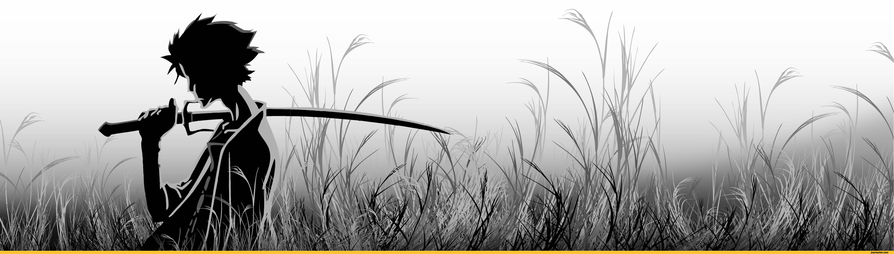

  <!-- Banner Minimalista DMC -->
  

  

  
  

  <!-- Badges de Visitas e Status em Preto e Branco -->
  
  
  

---

### 📜 UM POUCO SOBRE MIM

Sou estudante do primeiro semestre de Ciência da Computação na UniAnchieta e um aprendiz apaixonado por tecnologia. Estou sempre disposto a dominar novas ferramentas e explorar diferentes áreas do conhecimento.

Além de aprender, adoro orientar e dar mentoria para quem está começando na área. Atualmente, foco meus estudos no Desenvolvimento Back-end com C# .NET, enquanto aprimoro minha base em Estruturas de Dados e Algoritmos.

Também me dedico ao estudo da Cibersegurança. Acredito firmemente que todo desenvolvedor deve dominar os fundamentos de segurança para construir códigos robustos e protegidos contra ataques.

> *""Até o diabo pode chorar quando perde um ente querido... ou quando o código não compila.""*

---

### ⚔️ O QUE EU JÁ SEI?

    <!-- Badges Tecnologias Monocromáticas -->
  
  
  
  
  
  
  
  

---

### 📚 O QUE ESTOU APRENDENDO ATUALMENTE?

  
  
  

---
## 📊 RANKING DE CAÇADOR DE DEMÔNIOS

  
  

  <picture>
    <source media="(prefers-color-scheme: dark)" srcset="https://github.com/V3cTr0R">
    <source media="(prefers-color-scheme: light)" srcset="https://github.com/V3cTr0R">
    
  </picture>

---

Let's rock, baby!

